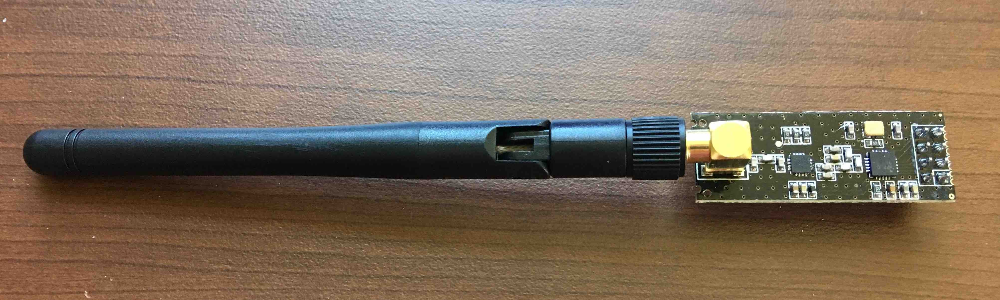

# nRF24L01
An nRF24L01 library for Arduino, built from scratch, as a school project. It's built in such a way that it can easily be ported over to other microcontrollers.

## Summary

  The nRF24L01+ is a transceiver IC that is often built into cheap transceiver modules. These modules are often used with microcontrollers to provide wireless communication between two or more devices. Arduino is the most common microcontroller used, which this library directly supports. Generally, for a two transceiver system, one transceiver is set up as the _primary transmitter_ and the other is set up as the _primary receiver_. The primary receiver can still send data to the transmitter, but there are some requirements when doing this. First, _Automatic acknowledgement packets_ and _ACK payloads_ must be enabled. Second, the receiver can only _reply_ with data after receiving data from the transmitter. It can never initiate its own send operation.

## nRF24L01+ Modules

Here's a picture of a common nRF module. It has an nRF24L01+ chip soldered onto a printed circuit board with a bunch of other necessary components. It also has a long range antenna, which greatly extends the range of the module.

The nRF24L01+ claims data rates up to 2Mbps, but I've only been able to achieve about ~0.6Mbps.

### Pinout
| Column 1 | Column 2 |
| ---- | ----- |
| V+ | GND |
| CSN | CE |
| MOSI | SCK |
| IRQ | MISO |

##### V+
The supply voltage depends on the voltage of the GPIO you intend to connect to the nRF. If you have a microcontroller with `3.3v` IO, you should supply the module with `1.9-3.6v`. If however, you're using a microcontroller with `5v` IO, you should supply the module with `2.7-3.3v`.

##### GND
Connect to ground.

##### CE
The CE (Chip Enable) pin is used to tell the nRF to start transmitting or receiving. This can be any digital pin you want.

##### MOSI, MISO, CSN, SCK
Check your [Arduino's pinout for SPI](https://www.arduino.cc/en/Reference/SPI) to see what these pins should be.

The CSN (Chip Select Not) pin is pulled low by SPI to enable the nRF module when it needs to read or write to it. If you're using an Arduino UNO, pin 10 is hard wired for this purpose and used by the SPI library. If you're using a different Arduino, you should look up which digital pin is your SS (slave select) and use that pin.

MOSI and MISO are used for data transfer from the master to the slave and vice versa.

SCK is a clock signal that's used to keep the data transfer in sync.

##### IRQ

This should be connected to an [interrupt on your Arduino](https://www.arduino.cc/reference/en/language/functions/external-interrupts/attachinterrupt/). The nRF will output this pin `LOW` when it needs the Arduino to handle an important event. Such events include: "The data send operation successfully completed", "We retried sending the data numerous times, but the other transceiver never received it", or "We received data from a transmitter and you should read it now." The sample code in the "Examples" directory shows an example of how to set this up.

## Installation

Download the library as a zip file (or `git clone` if you'd prefer.) Move the `nRF24L1` folder into the Arduino software's `libraries` directory. Restart the Arduino IDE.

## Sample Usage

Please see the `Sender` and `Receiver` example sketches in the `Examples` directory.

## The Enhanced Shockburst Protocol

The nRF24L01+ sends and receives data using something called `Enhanced Shockburst`, which is a data transmission protocol that does a lot of the heavy lifting for us, making it super easy to send and receive data between two or more microcontrollers. It allows us to send data in convenient packets ranging from 1-32 bytes by merely uploading our data through SPI to the nRF. The nRF automatically handles sending/receiving these packets and will notify us by the IRQ pin of when we should write/read data. 

The receiving nRF can also automatically notify the transmitting nRF that the data was successfully received through a feature called _automatic acknowledge packets_, in which the transmitter will temporarily change to receiving mode so the receiver can send an _ack packet_ saying that it received the data. The receiver can even send a small amount of data back with the ack packet, allowing bidirectional communication.

And much like a computer on a network, each transceiver also has its own address (or addresses) associated with it. In addition to both transceivers being on the same channel, in order to send and receive data, the transmitter must be transmitting to the same address assigned to the receiver. This address can be 3-5 bytes. When a transceiver is a primary receiver, it constantly searches for a valid address in the demodulated signals it receives.

### Packet Structure

Internally, this is what an Enhanced Shockburst packet looks like. The nRF automatically assembles/disassembles these packets for us, so in reality we never touch these ourselves.

| Preamble | Address | Packet Control Field | Payload | CRC | 
| ---- | ----- | ----- | ----- | ----- |
| 1 byte | 3-5 bytes | 9 bits | 1-32 bytes | 1-2 bytes |
| Automatically generated bit sequence that's used by the nRF to synchronize to the incoming stream of bits. | For *transmitters*, this is the address of the receiver we're sending data to. For *receivers*, this is the address that differentiates us from other receivers on the same channel. | These bits are hidden from the user and are used internally for payload length, packet identification, and whether or not to send an ACK upon receiving. | The data that we're sending or receiving. | CRC stands for cyclic redundancy check and helps the nRF figure out if any data was corrupted between being transmitted and received. |  

## Methods

## Porting the Library

The library was designed to be easily ported to other microcontrollers. In order to add support for another microcontroller, create a new class that inherits from and implements all the virtual methods of `NRF24L01Interface`. For an example, please see the `ArduinoInterface` class.
